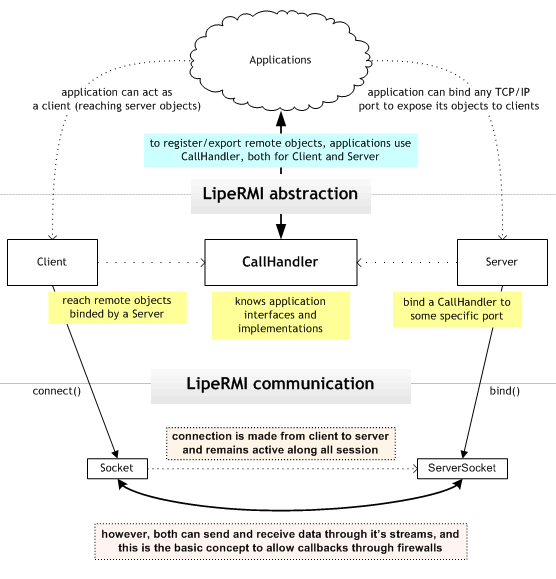

## Overview


## Basic usage code examples

Whenever you would need to use LipeRMI, you always must have a CallHandler. CallHandler is responsible for knowing about all local exported objects and about remote instances. So, let's start creating one:
```java
CallHandler callHandler = new CallHandler();

```

Once instanciated, you can use it's methods to export your objects, like this:
```java
InterfaceIAmExposing interfaceImplementation;
interfaceImplementation = new InterfaceIAmExposingImpl();
callHandler.registerGlobal(InterfaceIAmExposing.class,
  interfaceImplementation);

```

Now like a magic you can bind this to a port using the LipeRMI Server object:
```java
Server server = new Server();
int thePortIWantToBind = 4455;
server.bind(thePortIWantToBind, callHandler);

```
At this time, our "`interfaceImplementation`" object instance is completely remote accesible through LipeRMI Client object. The exposed methods in "`interfaceImplementation`" are described by `InterfaceIAmExposing` interface.
So, let's use it in client application. Firstly we need to make a connection to Server:
```java
CallHandler callHandler = new CallHandler();
String remoteHost = "localhost";
int portWasBinded = 4455;
Client client = new Client(remoteHost, portWasBinded, callHandler);
```

Now we can get abstracted proxys for remote objects globally exported:
```java
InterfaceIAmExposing remoteObject;
remoteObject = (InterfaceIAmExposing) client.getGlobal(InterfaceIAmExposing.class);

```

And, finally, remote methods can be invocated in client through this transparent proxy:
```java
remoteObject.someMethod();

```

## Adapting RMI applications to LipeRMI

You do not need to remove native RMI references to use LipeRMI, however it is highly recommendable.
Your interface must be cleaner as possible, **favoring less coupling implementations**.

For this reason, LipeRMI doesn't require your services extend the "Remote" interface. Methods also doesn't need to declare any exceptions like RemoteException.

Because LipeRMI was made to work in Internet environment, Naming and Registry services doesn't make much sense and until now it's not implemented by LipeRMI. The only way to reach a Server is knowing it IP address or hostname.

Registry binding code must be changed to use the LipeRMI Server object. You can invoke `bind()` method informing as arguments port and a `CallHandler`.

Client doesn't connect anymore through a Registry. It uses a Client object constructed with server hostname, server port and a `Callhandler`

Let's see a quite simple example. Imagine this interface (already with RMI signatures removed):
```java
public interface ExampleService {
    void someMethod();
}

```

and a implementation to this service in server application:
```java
public class ExampleServiceImpl {
    public void someMethod() {
        System.out.println("someMethod() called");
    }
}

```

Now, let's see server code which exports object:
```java
ExampleServiceImpl myService = new ExampleServiceImpl();
Naming.rebind("//localhost:4455/ExampleService", myService);

```

in LipeRMI it becames:
```java
ExampleServiceImpl myService = new ExampleServiceImpl();
// it always need a CallHandler!
CallHandler callHandler = new CallHandler();
callHandler.registerGlobal(ExampleService.class, myService);
server.bind(4455, callHandler);

```

See the difference? The "`CallHandler`" concept makes RMI more clean decoupling multiple sessions.

Also, `registerGlobal` method works very like binding/naming service. The difference here is: without a registry, you always need a connection to get a exported (global or not) object

At RMI client side we must have some like this:
```java
ExampleService myServiceRemote;
myServiceRemote =
  (ExampleService) Naming.lookup("//localhost:4455/ExampleService");
myServiceRemote.someMethod();

```

with LipeRMI it becames:
```java
// it always need a CallHandler!
CallHandler callHandler = new CallHandler();
// first we need to connect..
Client client = new Client("localhost", 4455, callHandler);
// then we can get the remote reference
ExampleService myServiceRemote;
  myServiceRemote = (ExampleService) client.getGlobal(TestService.class);
myServiceRemote.someMethod();

```

Quite simply, isn't? Just remember: `CallHandler` is the middlepoint to connections. You only need another `CallHandler` instance when you need a separated LipeRMI session with different implementations and objects. Also, remember that exporting objects now is a `CallHandler` task.

## Adapting remote listeners to LipeRMI

Remote listeners with RMI are exported using the code below:
```java
MyRemoteListener listenerImplementation = new MyRemoteListenerImpl();
int exportedPort = 0; // not specified port
UnicastRemoteObject.exportObject(listenerImplementation, exportedPort);

```

Since with LipeRMI we already have a CallHandler (and generally also a connection), just use it:
```java
MyRemoteListener listenerImplementation = new MyRemoteListenerImpl();
callHandler.exportObject(MyRemoteListener.class, listenerImplementation);

```

You don't need to care about your listener port since LipeRMI will uses the already connected socket to transport listener calls.

## Knowing clients hostname

With RMI you can call a static method to know who called a local method remotelly.

You can do this with:
```java
UnicastServerRef.getClientHost();

```

which magically returns the hostname of method caller.

With LipeRMI you can know about the whole socket, so you can do a little bit more.
It works very like RMI. It is a static method too:

```java
CallLookup.getCurrentSocket();

```
